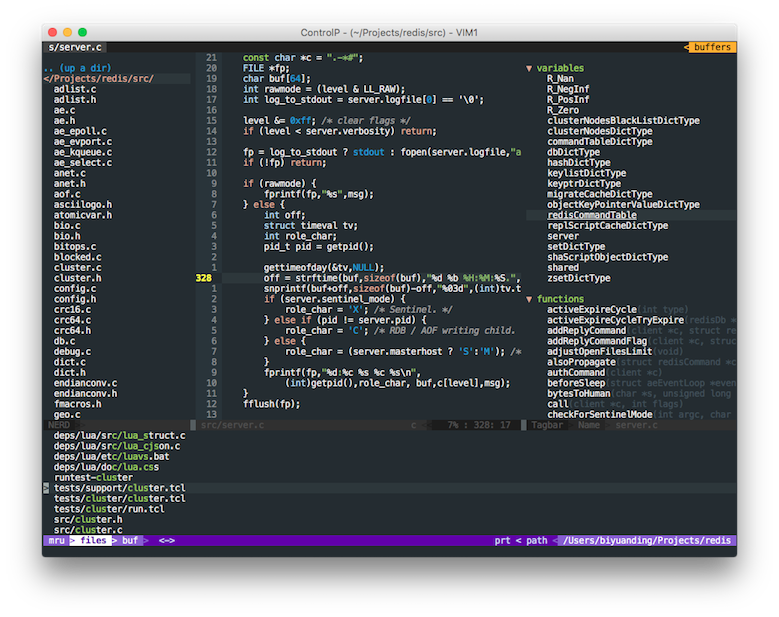

Thomas Ding's Vim Configuration
=========================



**Handy and Customizable!**

Utilize **NERDTree**, **Fugitive**, **Ctrl-P**, and many excellent plugins now.

Installation
==============

The Automatic Way
------------------

In OS X and Linux where `curl` is installed, td-vimrc can be installed with one
command in the terminal:

1. Clone the vimrc into your home directory:
    ```
    $ curl https://raw.githubusercontent.com/thomasding/td-vimrc/master/install.sh | sh -
    ```
    It will clone this repo into ~/.td-vimrc, clone Vundle (the package manager that
    this vimrc uses, which need cloning manually) into ~/.vim/bundle/Vundle.vim, and
    create three local customizable vimrc files `~/.vimrc.before.local`,
    `~/.vimrc.after.local` and `~/.vimrc.plugin.local`.

2. Enable extra features (optional):
    After these repos are successfully cloned into the local disk, edit `~/.vimrc.before.local`
    and enable the features that you need, which are mostly related to specific languages
    or terminal utilities. Skip this step if the basic feature is enough (see [Features]
    for what the vimrc utilizes for a basic feature).

3. Install all the plugins:
    Run `:PluginInstall` in VIM or `vim +PluginInstall +qa` in terminal to install
    the plugins that the vimrc requires.


The Manual Way
---------------

In Windows or OS X and Linux where `curl` is not available, td-vimrc has to be
installed manually by following these steps:

1. Clone this repository into your home directory:

    $ git clone https://github.com/thomasding/td-vimrc.git ~/.td-vimrc

2. Link the vimrc to ~/.vimrc:

    a. In OS X or Linux:

        $ ln -s ~/.td-vimrc/vimrc ~/.vimrc

    b. In Windows:

        Start CMD as administrator, change to home directory, and:

        C:\Users\{Your Home}> mklink .vimrc .td-vimrc\vimrc

3. Install Vundle:

    $ git clone https://github.com/VundleVim/Vundle.vim.git ~/.vim/bundle/Vundle.vim

4. Create local

5. Enable extra features (optional):

After these repos are successfully cloned into the local disk, edit `~/.vimrc.before.local`
and enable the features that you need, which are mostly related to specific languages
or terminal utilities. Skip this step if the basic feature is enough (see [Features]
for what the vimrc utilizes for a basic feature).

6. Install all the plugins:

Run `:PluginInstall` in VIM or `vim +PluginInstall +qa` in terminal to install
the plugins that the vimrc requires.

Supported Plugins
=================

* Vundle.vim: a bundle manager for VIM.
* ctrlp: a convenient tool for fuzzy file searching.
* vim-airline: a powerful and beautiful status line enhancement implemented fully in vim script.
* vim-fugitive: use git in vim.
* vim-gitgutter: show the modifications compared to the last commit in git repo in the gutter.
* vim-surround: an easy-to-use quoting and parenthesizing plugin.
* vim-colorschemes: one colorscheme pack that rule them all.
* nerdtree: a powerful tree-structured directory manager.
* nerdtree-git-plugin: show the status of a file in the git repo in nerdtree.
* undotree: move around the undo tree more conveniently.
* emmet-vim: emmet in vim.
* vim-jinja: jinja2 syntax.
* vim-flavored-markdown: github flavord markdown syntax highlighting.
* vim-javascript: enhanced javascript syntax highlighting.
* vim-jsx: jsx syntax highlighting.
* tmuxline.vim: unify tmux statusline with vim.
* vim-tmux-nagivator: move around vim windows and tmux buffers coherently.
* better-indent-for-php-with-html: better indent for php files.
* php.vim: php syntax highlighting.
* html5.vim: html5 syntax highlighting.
* syntastic: powerful code linting tool for many languages.

Features
===========

* Structured and well-documented vimrc.
* Bind ESC to jj.
* Hide menu, scrollbars and toolbar in GUI.
* Use Monospace as the default font in Linux and Consolas in Windows.
* Map leader key to comma.
* Key bindings to frequent fugitive commands, see below.
* Disable backup and swapfile.
* Show a vertical line in Column 80.
* Do not wrap lines automatically.
* Use Github Flavored Markdown as the default markdown syntax.

Fugitive Key Bindings
======================

    Shortcut    Command     Description
  -------------------------------------------------
    ,gs         :Gstatus    show the status of the git repo
    ,gc         :Gcommit    commit the staged changes
    ,gw         :Gwrite     save the current buffer and stage the file
    ,gd         :Gdiff      diff the current buffer with the last commit
    ,gb         :Gblame     blame the current buffer

Other Key Bindings
=====================

    Shortcut    Command             Description
  ---------------------------------------------------------------
    ,n          :NERDTreeToogle     toggle the nerd tree
    ,u          :UndotreeToggle     toggle the undo tree
    Ctrl-P      :CtrlP              show the Ctrl-P panel
